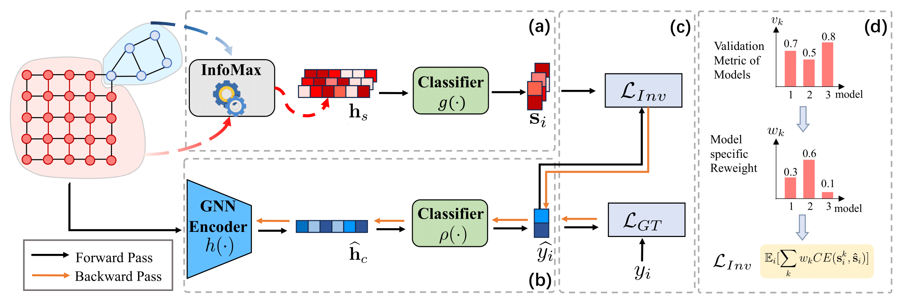

# Empowering Graph Invariance Learning with Deep Spurious Infomax
This repository is the official implementation of our paper:

**Empowering Graph Invariance Learning with Deep Spurious Infomax**

_Tianjun Yao, Yongqiang Chen, Zhenhao Chen, Kai Hu, Zhiqiang Shen, Kun Zhang_

International Conference of Machine Learning 2024 (ICML2024)

<div align=center>
</div>


## Poster

<div align=center>
</div>

## Environment
To run the code successfully, the following dependencies need to be installed:
```
Python                     3.9      
torch                      2.1.2+cu118
torch_geometric            2.4.0
ogb                        1.3.5
```


## Data
The data used in the experiments can be downloaded from the following sources:

1. SPMotif

Go to `dataset_gen/`, run the following command to generate SPMotif datasets:

```bash
python gen_struc.py --bias 0.90
```

It will generate a SPMotif dataset with $bias=0.90$.

P.S.: To generate datasets for SPMotif and Twp-piece graph, the numpy version must be speficied to 1.20.0, after loading the datasets in PyG, the numpy version should be upgraded to 1.24.3.

2. Two-piece graph

Go to `dataset_gen/`, run the following command to generate two-piece graph datasets:

```bash
python gen_basis.py
```

For the three configurations in our paper, use the following `global_b` and `label_noise`:

-(0.8,0.7): `global_b=0.7`,`label_noise=0.2`
-(0.8,0.9): `global_b=0.9`,`label_noise=0.2`
-(0.7,0.9): `global_b=0.9`,`label_noise=0.3`


3. DrugOOD


To use DrugOOD datasets, curate the datasets according to [DrugOOD Benchmark repo](https://github.com/tencent-ailab/DrugOOD) based on commit `eeb00b8da7646e1947ca7aec93041052a48bd45e`, After curating the datasets, put the corresponding json files under `data/DrugOOD/`. The processed json files are also provided at [this url](https://drive.google.com/file/d/1ngsoGmZtKd72ZSFZv3qeEjq9WClog7Ay/view?usp=sharing). You can unzip it and put it under `data/`.

4. OGBG-Mol*


To use OGBG datasets, install the ogb package and specify the `--dataset` argument.


## Running Script

### Generate Spurious Embeddings

The first step is to generate spurious embeddings using infomax. Here is an example of how to do it.


```
python infomax.py --dataset drugood_lbap_core_ec50_scaffold --hidden_dims 64 --num_layers 5 --batch_size 128 --device_id 0'
```

It will run MVGRL to generate spurious embeddings, and save it to `embeddingWritingPath`, which is specified in the script (line 230). Currently the spurious embeddings are saved for every 3 epochs (line 331). 

### Run EQuAD

Run `run_ood_equad.py` for training and evaluation for EQuAD. Here is an example.

```
python run_ood_equad.py --dataset drugood_lbap_core_ec50_scaffold --nclass 2  --nhid 64 --edge_dim -1 --pooling sum --early_stop_epochs 10 --penalty 1e-3 --gamma 0.5 --valid_metric auc --temp 0.01 --device 0 --spu_emb_path 'path/to/spurious_emb/'
```


| Parameter | Description | Choices |
| --- | --- | --- |
| dataset | name of dataset | `SPMotif-0.40(or 0.33,0.60,0.90)`, `drugood_lbap_core_ec50_scaffold`, `drugood_lbap_core_ec50_size`, `drugood_lbap_core_ec50_assay`, `drugood_lbap_core_ic50_scaffold`, `drugood_lbap_core_ic50_size`, `drugood_lbap_core_ic50_assay`,`ogbg-molbace`,`ogbg-molbbbp`.
| nclass | number of classes | e.g., 3|
| nhid | hidden dimension size | e.g., 64 |
| edge_dim | dimensions of edge features | specify to be -1 if not using edge features |
| gamma | reweighting coefficient | - |
| valid_metric | validation metric | For SPMotif and Two-piece graph, it should be `acc`, and for other datasets, it should be `auc` |
| temp | temperature for the softmax function to perform top-K model average | - |
| spu_emb_path | The location the spurious embedding generated by Infomax is placed | when `spu_emb_path` is a dir, then the code will scan all the embeddings end with `xxxx.pt`; when  `spu_emb_path` is a file end with name `xxx.pt`, it will use it for the subsequent actions.|
| device | which GPU to use | - |


## Citation
If you find our paper and repo useful, please cite our paper:

```bibtex
@inproceedings{
yao2024empowering,
title={Empowering Graph Invariance Learning with Deep Spurious Infomax},
author={Tianjun Yao and Yongqiang Chen and Zhenhao Chen and Kai Hu and Zhiqiang Shen and Kun Zhang},
booktitle={Forty-first International Conference on Machine Learning},
year={2024},
url={https://openreview.net/forum?id=u9oSQtujCF}
}
```
